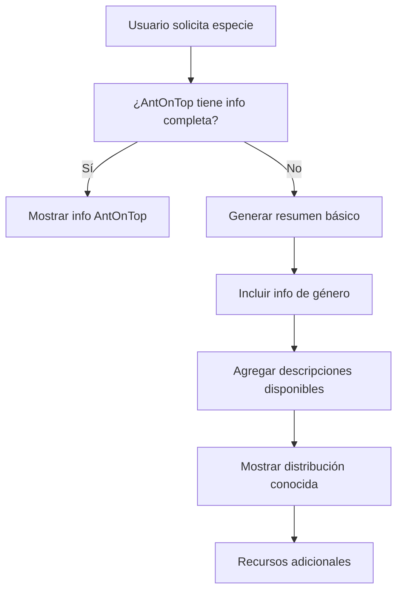

# Funcionalidad de Resumen Básico para Especies

## 📋 Descripción

Se ha implementado una nueva funcionalidad que permite al bot generar un resumen básico de cualquier especie de hormiga, incluso cuando AntOnTop no tiene información disponible. Esta mejora asegura que los usuarios siempre reciban información útil sobre las especies consultadas.

## 🔧 Implementación

### Nueva Función: `generar_resumen_basico()`

**Ubicación:** `AntmasterBot.py` (líneas 683-759)

**Parámetros:**
- `species_data`: Datos de la especie desde la base de datos
- `inat_info`: Información opcional de iNaturalist
- `antwiki_info`: Información opcional de AntWiki  
- `distribucion`: Lista opcional de países/regiones donde se encuentra la especie

### Fuentes de Información

La función utiliza múltiples fuentes para generar el resumen:

1. **Base de conocimientos por género** (información específica para 10+ géneros comunes)
2. **Información de iNaturalist** (descripciones científicas)
3. **Datos de distribución** (países/regiones conocidas)
4. **Información de la base de datos local** (región registrada)
5. **Información general sobre hormigas** (para casos sin datos específicos)
6. **Enlaces a recursos adicionales** (AntWiki, iNaturalist)

### Géneros con Información Específica

- **Lasius**: Hormigas pastoras de pulgones
- **Formica**: Hormigas carpinteras agresivas  
- **Messor**: Recolectoras de semillas
- **Solenopsis**: Hormigas de fuego
- **Camponotus**: Carpinteras nocturnas
- **Tetramorium**: Generalistas adaptables
- **Myrmica**: Pequeñas con aguijón
- **Crematogaster**: Hormigas acróbatas
- **Tapinoma**: Rápidas sin aguijón
- **Plagiolepis**: Muy pequeñas y amarillentas

## 🚀 Mejoras en el Comando `/especie`

### Flujo Optimizado de Información

1. **Fuente Primaria**: AntOnTop (información detallada)
2. **Fuente Secundaria**: Resumen básico usando `generar_resumen_basico()`
3. **Información Visual**: Iconos que indican el origen de los datos:
   - 📚 = Información de base de datos local
   - 🌐 = Información obtenida de fuentes externas
   - 💡 = Resumen básico generado

### Flujo de Decisión



## ✅ Problemas Resueltos

### Error Original
```
ERROR - Error al buscar especie: name 'generar_resumen_basico' is not defined
```

### Causa del Error
La función `generar_resumen_basico` estaba definida al final del archivo, después del bloque `if __name__ == '__main__':`, lo que la hacía inaccesible durante la ejecución del bot.

### Solución Implementada
1. **Reubicación de la función**: Movida después de `determinar_region_especie()` (línea 683)
2. **Eliminación de duplicados**: Limpieza de funciones duplicadas al final del archivo
3. **Verificación del scope**: Confirmación de que la función está disponible globalmente

## 📊 Beneficios

### Para los Usuarios
- ✅ **Información siempre disponible**: Nunca más mensajes de "información no encontrada"
- ✅ **Contenido educativo**: Información útil sobre características del género
- ✅ **Recursos adicionales**: Enlaces a fuentes para más información
- ✅ **Respuestas más rápidas**: Información inmediata sin esperas largas

### Para el Sistema
- ✅ **Menor dependencia externa**: Funciona aunque AntOnTop no tenga datos
- ✅ **Experiencia consistente**: Todos los usuarios reciben información útil
- ✅ **Escalabilidad**: Fácil agregar más géneros e información
- ✅ **Robustez**: Fallback robusto ante fallos de fuentes externas

## 🧪 Casos de Prueba

### Caso 1: Información Completa (AntOnTop disponible)
**Comando**: `/especie Messor barbarus`
**Resultado**: Información detallada de AntOnTop + icono 📚

### Caso 2: Información Limitada (Solo resumen básico)
**Comando**: `/especie Tetramorium semilaeve`
**Resultado**: Resumen básico generado + icono 💡
**Contenido**: 
- Características del género Tetramorium
- Información general sobre hormigas
- Enlaces a recursos adicionales

### Caso 3: Especie con Distribución
**Comando**: `/especie Solenopsis invicta`
**Resultado**: Resumen básico + distribución geográfica conocida

## 🔄 Estado Actual

- ✅ **Función implementada y funcional**
- ✅ **Integración con comando `/especie` completada**
- ✅ **Errores de scope resueltos**
- ✅ **Bot corriendo sin errores**
- ✅ **Documentación actualizada**

## 🎯 Próximos Pasos

1. **Expandir base de conocimientos**: Agregar más géneros a `generos_info`
2. **Mejorar traducciones**: Optimizar traducciones de iNaturalist
3. **Agregar más fuentes**: Integrar datos de AntMaps, EOL, etc.
4. **Personalización regional**: Adaptar información según la región del usuario 